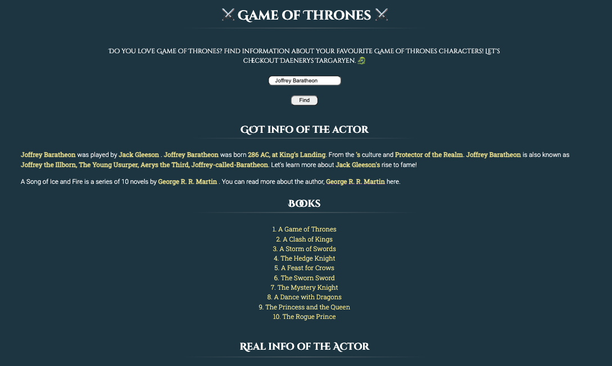

# Movies API Project 🎥

##  ⚔️🤴👑 **Do you like Game of Thrones?**  ⚔️🤴👑

Our application is all about **Game of Thrones** and **movies**. 

The user can search for their favourite Game of Thrones character using the search bar. It will provide the user with a brief synopsis of the character's life. It will include who they were played by in the TV series, the character's DOB, title, and more information from the books.

The user can then find more information about the person who starred in that role. It will return movies they starred in, release dates, movie posters, images, and more. It will also link to IMDb for the user to find out more information. 

You can find out site hosted [here!](https://joe-lindie.github.io/Game-of-Thrones-Project/)

### **Accessibility / APIs:** 

- The user can access this app on both mobile and desktop devices. 
- This app uses the Game of Thrones API and TMDB API. 
- The user can information about their favourite GoT character. 

### **Here's a Sneak Peek** 

#### Desktop Layout 

#### Mobile Layout 
